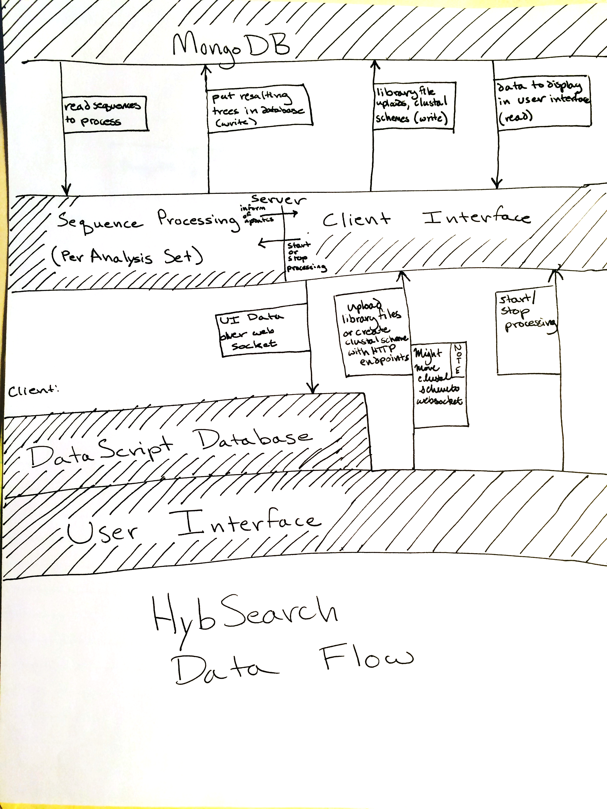

#Architecture Documentation

##Contents
- Things you might want to do/add
- Getting Started
- Project Structure
- Data Flow
- Server Architecture
- Data Model
- Client Architecture (User Interface)
- Processing Strategy

##Things you might want to do/add
- Test the app a lot. I tested a lot of things but there are probably edge cases I missed on, like, malformed file uploads or something.
- Validate incoming data before saving it in the database to make sure nothing malformed makes it in.
- Upload the GenBank files over AJAX. For some reason jQuery's `.post` method won't set the right enctype on
- Log errors that clustalw prints to stderr. Right now it doesn't appear to be printing any errors, but in the event that it does in the future it would be nice to inform users.
- Allow deletion of clustal schemes and analysis sets. I didn't implement this because it doesn't seem like it would be desireable to lose the data from a long-running job through accidental deletion. If you really need to delete something, you can do it manually through the MongoDB shell (though be sure to also delete associated trees if you delete a clustal scheme).
- Data export. Maybe Steve and co. want to be able to download data into a file.
- Expand the query UI with more options.
- Fix UI bugs. Some of the scrollable sections occasionally cut off the very bottom. If the numbers in a stat on the Processing tab get to long, they will overflow into the next stat panel.
- Supply a new `updated-fn` to the api that can put a cap on the rate of state pushes.
- Rather than compiling the server directly on the cluster, it might be easier to compile a production binary that can just be run on the cluster. I imagine that you would run `boot production` to do this, and I'm pretty sure that `core.clj` is the entry point for a production build. I never modified `core.clj` beyond a brief comment, so you'll have to modify it to start the server. See the `devserver.clj` file for an example of how to start the server. I think you'd want to run the same code, but without the `with-pre-wrap` wrapper.
- Optimize stuff. Especially the code that shuffles data around in the job manager prior to processing, or the code that determines how many triples are left. You don't really notice the delay on smaller jobs, but I ran one that involved 300,000+ triples, and it takes about 20-30 seconds to verify and spin up a job on that size dataset.
- Audit the app for security. IT IS NOT SECURE RIGHT NOW, and I imagine it will only ever be used on St. Olaf's internal network, so maybe that's not a big deal. But here are some potential security issues off the top of my head right now: No CSRF token set for Sente (websocket comms), no authentication to access the server, no authentication to access the database, no data validation before saving data.


##Getting Started
- Installing Clojure tools
- Installing MongoDB
- Installing ClustalW
- Running the database
- Running the server

###Installing Clojure tools
To run Clojure code and build this application, you need to have Java 1.6 ("version 6") or higher, Leiningen 2.x, and Boot (version 1) installed.
- Java install (I'm using version 8 currently):  http://www.oracle.com/technetwork/java/javase/downloads/index.html
- On OSX you can install Leiningen via homebrew, otherwise follow the instructions here: https://github.com/technomancy/leiningen/wiki/Packaging
- Boot (version 1): https://github.com/tailrecursion/boot

###Installing MongoDB
- Platform-specific instructions: http://docs.mongodb.org/manual/installation/

###Installing ClustalW
- Go here http://www.clustal.org/clustal2/#Download
- Download the ClustalW 2.1 binary for your system.
- Make sure it is in your `PATH` environment var, so the server can find it.

###Running the database
- Instructions here: http://docs.mongodb.org/manual/tutorial/install-mongodb-on-os-x/#run-mongodb

###Running the server
- Make sure that the database is running before you run the server. To run the server, `cd` into the directory containing the `build.boot` file, and run `boot development`.  

##Project Structure
```
hybsearch
 | aux: Contains the Perl script version.
 |  | output: The Perl script targets this directory for output.
 |  | reciprocal.pl: The Perl script.
 | doc: Documentation.
 |  | lib: Contains KaTeX library for rendering mathematics.
 |  | structures.html: Describes the mathematical structures
 |  |                  used to process sequences.
 |  | architecture.md: The document you're currently reading :).
 | resources
 |  | public: The application compiles into this directory.
 | src: Source code for the web application.
 |  | clj
 |  |  | hybsearch
 |  |  |  | db
 |  |  |  | | collections.clj: Static definitions of collection names.
 |  |  |  | | crud.clj: Create, Read, Update, Delete methods for database.
 |  |  |  | | init.clj: Database init wrapper, ensures that db connection
 |  |  |  | |           is initialized before accessing (note: does not
 |  |  |  | |           yet throw an error if ensure-db fails).
 |  |  |  | api.clj: Server side endpoints for client-server api.
 |  |  |  | core.clj: I think this is used in production builds, definitely
 |  |  |  |           not used in development builds.
 |  |  |  | devserver.clj: Code for launching the server in development mode.
 |  |  |  | server.clj: Ring middleware, routing, and web socket handlers.
 |  |  |  | job_manager.clj: Runs triple processing.
 |  |  |  | clustalw.clj: Interface to ClustalW
 |  | cljs
 |  |  | hybsearch
 |  |  |  | rpc.cljs: Client side endpoints for client-server api.
 |  | hl
 |  |  | hybsearch
 |  |  |  | ui: Custom UI components, defined with the Hoplon
 |  |  |  |     templating language.
 |  |  |  | index.cljs.html: The main page for the application.
 |  |  | main.inc.css: Some basic css that Hoplon includes. I'm pretty sure
 |  |  |               we can just delete this, but I haven't risked it yet.
 |  |
 | .gitignore
 | build.boot: This file contains the Boot build configuration,
 |             including third-party dependencies.
 |README.md
```

##Data Flow



The application's data flow is designed to be as unidirectional as possible to make it easier to reason about.

You can think of the server as consisting of two main modules. The first module (on the right in the diagram) has one part that transforms UI data to a datascript representation and pushes it to the client and another part that handles incoming uploads and requests to start or stop processing on a given analysis set.

The second main module (not yet implemented) manages the processing of analysis sets. When the server starts up, no sets are processing. When UI state is pushed to the client, this module is checked to see which are processing, and that state is included in UI state. This module can also inform the first main module that changes have been made during processing. The first main module makes the decision about when to push the new UI state to the client.

The client also consists of two parts. All UI state is stored in DataScript databases. There is currently only one DataScript database, but we might add more to split up different kinds of data pushes (e.g. analysis set info in one, query results in another). When UI data is pushed, the entire database is replaced with a new database created from the new data, and this replacement triggers a UI update. While this seems hilariously inefficient, it turns out to be reasonably performant, and is worth doing because it makes UI state far easier to reason about.

The "User Interface" part of the client contains all of the components for exploring the data in the DataScript database and for sending data (clustal scheme creation form, analysis set creation by uploading a library file, and start/stop processing) to the server.

Notice that all data travels from the server to the DataScript database, from the DataScript database to the user interface, or from the user interface to the server. This unidirectional flow makes the client-server interaction easier to think about.


##Server Architecture
The code in the `server.clj` file forwards incoming data to the API or sends data back to the client.

The server is built on top of [HTTP Kit](http://www.http-kit.org/), which is a Ring-compatible client-server library for Clojure. [Ring](https://github.com/ring-clojure/ring) is a set of standard interfaces wrapping HTTP and allowing you to functionally compose the middleware of your server.

Communication with the server happens over two media: HTTP routes and web sockets. The routing for HTTP is defined with the [Compojure](https://github.com/weavejester/compojure) library, which composes into the Ring middleware. We use the [Sente](https://github.com/ptaoussanis/sente) library for the websocket connections.

The HTTP routes are used for setting up a web socket with the client and for uploading data. The web socket allows the client to request state and allows the server to push state to the client. When the web socket becomes active, the client immediately uses it to request state.

The schemas for the DataScript databases are in the `rpc.cljs` file. The server converts MongoDB objects to DataScript entities by renaming their keys to match the DataScript schema and then converting MongoDB ObjectIds to strings.

##Data Model
This section originally specified what objects in various collections in the database look like. I recommend that you instead refer to the methods that construct objects in `api.clj` and `job_manager.clj`, since those will always be the most up-to-date authority. That said, MongoDB does not enforce a strict schema (that's another reason data validation could be something useful to add), so there's always the possibility of old data not matching data that was constructed after a change was made to a constructor. This will not be a problem if you never edit the constructors, or if modified constructors only ever touch a fresh, empty database.

###Monger
All of the interaction with the database is ultimately performed through Monger, which you can find here: http://clojuremongodb.info/. It has pretty good docs of its own.


##Client Architecture (User Interface)
The UI relies on the following dependencies:
- Hoplon templating language:
- Javelin cells:
- Datascript:

##Processing Strategy
- structures.html covers the theoretical side of this
